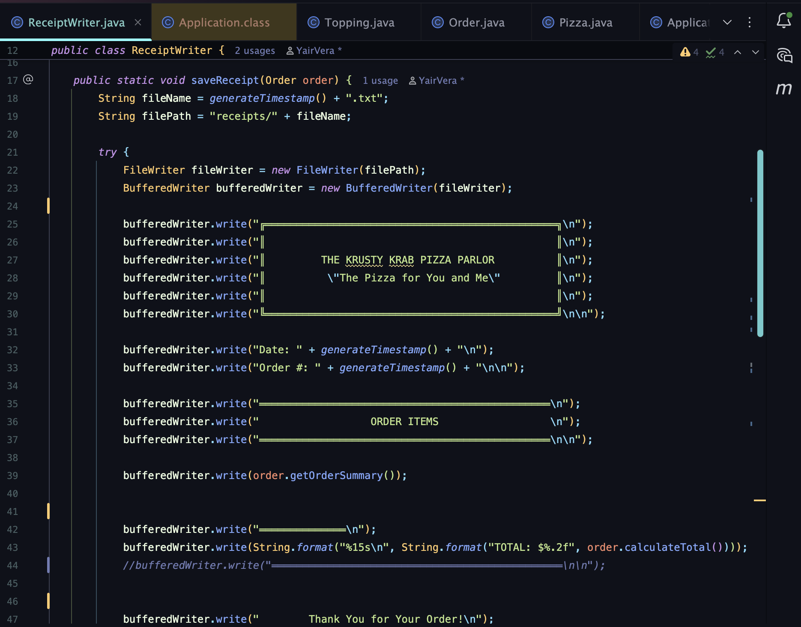
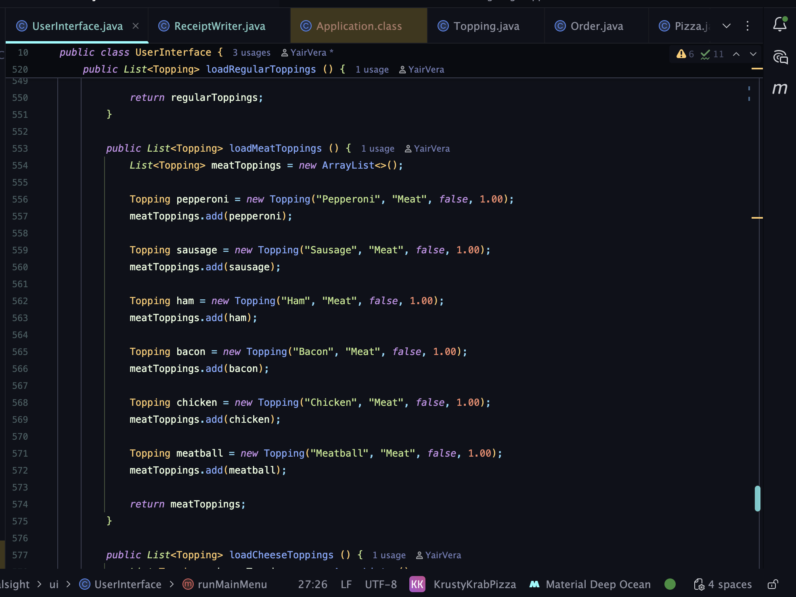
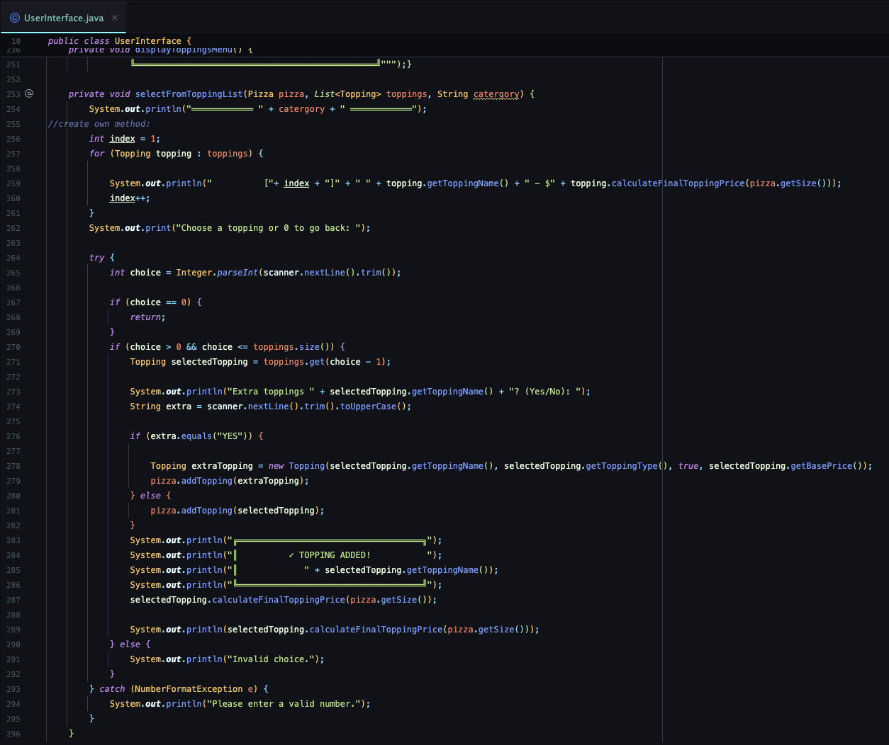

# Krusty Krab Pizza

## Application Description:
Build your own pizza with our Pizza Builder application. Choose your pizza size, crust type, toppings,
and more! Let your imagination run wild! Once you're done make sure to buy a drink, we carry several 
different fountain drinks... oh and don't forget your Garlic Knots!

## Features:
* Star order
* Build your own Pizza
  * Select your pizza size
  * Select the crust type
  * Select the toppings
  * Select the sauce type
  * Select the cheese type
* Add a Drink to your order 
* Add Garlic Knots to your order
* Checkout
* Print order receipt

## Here is some code!
This shows some of the ReceiptWriter class.

## Interesting Code:
I found this particular method interesting since it creates a list of all the toppings
and it's attributes which later get looped through in order to display them on the Toppings
Menu screen when prompted by the user. 

This shows the loop

